# From the 4-Hour Workweek to the 2-Minute Work Week

A collection of AI agent skills that turn the frameworks, exercises, and life-hacks from Tim Ferriss's _The 4-Hour Workweek_ into things you can run against your personal situation — plus a 2026 layer that "outsources" repatative or low cognition tasks to AI.

Built for anyone who wants to apply lifestyle design to their work, business, or life — with an AI agent doing the heavy lifting on the structured exercises Tim makes you do in the book, and on the operational work he made you hire a person for.

Works with Claude Code, Cursor, Codex, Windsurf, Cowork, and any agent that supports the [Agent Skills spec](https://agentskills.io).

> "Awareness is always the first step because if you are not aware, there is nothing you can change." — Miguel Ruiz

## What's in the box

These skills are not summaries of the book. They are the **exercises themselves**, run as a guided conversation. Most of them won't tell you what to do — they'll force _you_ to answer the same uncomfortable questions Tim makes the reader answer.

The set includes:

1. **The book skills** — the dreamlining, fear-setting, 80/20, muse, DEAL, mini-retirement frameworks, run as guided exercises. These are the canonical 4HWW frameworks.
2. **The 2026 AI extensions** — a smaller set of skills that update the book's "outsource it to a VA" reflex to a 2026 hierarchy: AI prompt → AI agent → script → scheduled task → Claude skill → human VA, in that order. Plus a rapid-deployment muse launcher and an AI deep-research counterpart to talking to humans.

If you've never read the book or didn't do the exercises, start with `/dreamlining`. It's the engine of the whole system.

If you have followed the book and want a refresher run through, start with `/deal-framework`.

## How the skills fit together

The system follows the book's **D-E-A-L** sequence: **D**efinition → **E**limination → **A**utomation → **L**iberation. The `lifestyle-design` skill is the foundation — every other skill checks it first to understand your current life, your constraints, and your dreamlines before doing anything.

The 2026 extensions sit primarily in the Automation phase, where the book is most out-of-date.

```mermaid
flowchart TD
    LD["**lifestyle-design**\n*(read by every skill)*"]

    LD --> D & E & A & L & M

    subgraph D["D — Define"]
        direction TB
        D1[dreamlining]
        D2[fear-setting]
        D3[relative-income]
    end

    subgraph E["E — Eliminate"]
        direction TB
        E1[eighty-twenty]
        E2[parkinsons-law]
        E3[low-info-diet]
        E4[not-to-do-list]
        E5[batching]
        E6[interruption-killer]
    end

    subgraph A["A — Automate"]
        direction TB
        A1[automate-first ★]
        A2[make-it-a-skill ★]
        A3[outsourcing]
        A4[email-autoresponder]
        A5[muse]
        A6[muse-test]
        A7[muse-launcher ★]
        A8[income-autopilot]
    end

    subgraph L["L — Liberate"]
        direction TB
        L1[remote-work-proposal]
        L2[mini-retirement]
    end

    subgraph M["Mindset & Style"]
        direction TB
        M1[new-rich-rules]
        M2[comfort-challenge]
        M3[cold-outreach]
        M4[expert-research]
        M5[deep-research ★]
    end
```



★ = 2026 AI extensions

See each skill's **Related Skills** section for the full map.

## Available Skills

<!-- SKILLS:START -->

| Skill                                                | Description                                                                                                                                                                                                          |
| ---------------------------------------------------- | -------------------------------------------------------------------------------------------------------------------------------------------------------------------------------------------------------------------- |
| [lifestyle-design](skills/lifestyle-design/)         | Foundation context every other skill reads first — your current life, constraints, dreamlines, target monthly income, and freedom criteria.                                                                          |
| [dreamlining](skills/dreamlining/)                   | The dreamline exercise from chapter 4 — 6-month and 12-month "having / being / doing" goals, target monthly income calculation, and the three steps that make each dream real.                                       |
| [fear-setting](skills/fear-setting/)                 | Tim's fear-setting exercise — define the nightmare, plan the repair, weigh the cost of inaction. The replacement for goal-setting when something scares you.                                                         |
| [deal-framework](skills/deal-framework/)             | Top-level walkthrough of D-E-A-L — Definition, Elimination, Automation, Liberation. Routes you to the right sub-skill at each step.                                                                                  |
| [new-rich-rules](skills/new-rich-rules/)             | The 9 mindset rules that change the rules — retirement is worst-case insurance, being unrealistic is easier, doing vs. being busy. The philosophical foundation.                                                     |
| [relative-income](skills/relative-income/)           | Calculate relative income (W = $/hour × freedom) instead of absolute income. Geo-arbitrage math and freedom-weighted decision making.                                                                                |
| [eighty-twenty](skills/eighty-twenty/)               | 80/20 (Pareto) audit of your customers, products, time, and stress. The two questions Tim asked that 10x'd his income.                                                                                               |
| [parkinsons-law](skills/parkinsons-law/)             | Apply Parkinson's Law: shrink deadlines, force the impossible, combine with 80/20 for the output multiplier.                                                                                                         |
| [low-info-diet](skills/low-info-diet/)               | Information fasting — the 1-week and ongoing protocol, what to consume, selective ignorance rules.                                                                                                                   |
| [not-to-do-list](skills/not-to-do-list/)             | Build a not-to-do list from Tim's 9 habits to eliminate. The opposite of a to-do list, and usually more important.                                                                                                   |
| [batching](skills/batching/)                         | Batch email, calls, errands, and content to kill switching costs. The math behind why batching works.                                                                                                                |
| [interruption-killer](skills/interruption-killer/)   | Eliminate the three types of interruption — time wasters, time consumers, empowerment failures — with specific scripts for each.                                                                                     |
| [email-autoresponder](skills/email-autoresponder/)   | Tim's autoresponder template + the email policy: check twice a day, batch, never first thing in the morning.                                                                                                         |
| [outsourcing](skills/outsourcing/)                   | Outsource your life — AI-first triage (Step 0) before any human VA. What to hand to AI, what to a script, what to a scheduled task, what to a person.                                                                |
| [automate-first](skills/automate-first/) ★           | The 2026 default-mode shift. Decision tree for any task: AI prompt / AI agent / script / scheduled task / Claude skill / human VA / DIY. The standalone version of `/outsourcing` Step 0.                            |
| [make-it-a-skill](skills/make-it-a-skill/) ★         | Wrap a recurring task as a reusable Claude skill or scheduled task. Routes between Anthropic's `skill-creator` and `schedule`. Never do the same thing twice.                                                        |
| [muse](skills/muse/)                                 | Evaluate or shape a business idea against the muse criteria — $50-200 price, 8-15 hr/week, 90%+ automatable. Interrogate your codebase or business and see how it fits.                                              |
| [muse-test](skills/muse-test/)                       | Cheaply test a muse before you build it — landing-page-and-ads test, pre-orders, micro-tests for demand validation.                                                                                                  |
| [muse-launcher](skills/muse-launcher/) ★             | The 2026 build phase. Once `/muse-test` passes, scaffold landing page, payments, email, ads, analytics in hours. Hard gate on testing first.                                                                         |
| [income-autopilot](skills/income-autopilot/)         | Architect a muse to run on autopilot — payment, fulfillment, customer service, the management black box that lets you disappear.                                                                                     |
| [remote-work-proposal](skills/remote-work-proposal/) | The Liberate negotiation — convince your boss to let you work remote using the 5-step "ask forgiveness, not permission" sequence.                                                                                    |
| [mini-retirement](skills/mini-retirement/)           | Plan a mini-retirement — 1-6 months somewhere new, geographic arbitrage, what to set up before you go and what to wind down.                                                                                         |
| [comfort-challenge](skills/comfort-challenge/)       | The daily comfort challenges from the book — eye contact, ask for a discount, the lie-down, two-cup-of-coffee. Calibrated to your current edge.                                                                      |
| [cold-outreach](skills/cold-outreach/)               | Cold outreach in Tim's style — short, peer-level, asking for help (not selling), specific questions, no jargon.                                                                                                      |
| [expert-research](skills/expert-research/)           | Find real people who have already done the thing you want to do, then design a focused interview to extract what they wish they'd known. The skill Tim used to research the book itself.                             |
| [deep-research](skills/deep-research/) ★             | AI deep-research counterpart to `/expert-research`. For questions answerable from public sources at scale — competitive analysis, market sizing, source compilation. Pair with `/expert-research`, don't substitute. |

<!-- SKILLS:END -->

★ = 2026 AI extensions ("2-minute work week" layer on top of the book skills)

## Installation

### Option 1: Claude Code Plugin

```bash
# Add the marketplace
/plugin marketplace add <your-fork>/fhww-skills

# Install all skills
/plugin install fhww-skills
```

### Option 2: Clone and Copy

```bash
git clone <your-fork>/fhww-skills.git
cp -r fhww-skills/skills/* .claude/skills/
```

### Option 3: Git Submodule

```bash
git submodule add <your-fork>/fhww-skills.git .claude/fhww-skills
```

Then reference skills from `.claude/fhww-skills/skills/`.

### Option 4: CLI Install (npx skills)

If you use the [npx skills](https://github.com/vercel-labs/skills) installer:

```bash
npx skills add <your-fork>/fhww-skills
npx skills add <your-fork>/fhww-skills --skill dreamlining fear-setting
npx skills add <your-fork>/fhww-skills --list
```

## Where to start

If you've never run any of this:

```
/dreamlining
```

That's the on-ramp. It will force you to write down what you actually want — in concrete, time-bound, dollar-priced detail — before you do anything else.

Then, once you have a dreamline:

```
/fear-setting
```

Run this on the single biggest action your dreamline implies. The thing you've been putting off.

Then, depending on what you find:

| If your situation is…                            | Run this                                                      |
| ------------------------------------------------ | ------------------------------------------------------------- |
| "I have a job and I want freedom from it"        | `/deal-framework` (the full sequence)                         |
| "I have a business idea and want to validate it" | `/muse` → `/muse-test` → `/muse-launcher`                     |
| "I'm overwhelmed at work"                        | `/eighty-twenty` → `/automate-first` → `/not-to-do-list`      |
| "I want to live abroad for a few months"         | `/mini-retirement`                                            |
| "I want to convince my boss I should be remote"  | `/remote-work-proposal`                                       |
| "I want to learn from people who've done this"   | `/expert-research` (humans) and/or `/deep-research` (sources) |
| "I keep doing the same thing every week"         | `/automate-first` → `/make-it-a-skill`                        |
| "I was about to hire a VA for X"                 | `/automate-first` first — usually it's automatable            |

## Direct invocation

You can call any skill explicitly:

```
/dreamlining
/fear-setting
/eighty-twenty
/muse
/cold-outreach
```

Or describe what you want and let your agent pick:

```
"Help me figure out what to actually go after"     → dreamlining
"I'm scared to quit my job"                        → fear-setting
"My business idea — does it pass the muse test?"   → muse
"Help me find experts who've done this"            → expert-research
"Compile every competitor for me"                  → deep-research
"I'm spending all day in email"                    → email-autoresponder
"Cut my workload by 80%"                           → eighty-twenty
"Should I automate this or hire a VA?"             → automate-first
"I keep doing this weekly — make it a skill"       → make-it-a-skill
"My muse-test passed, build it"                    → muse-launcher
```

## Skill Categories

### Definition (D)

The "what do you actually want" phase. Don't skip it.

- `dreamlining` — Concrete 6 and 12 month dreams, priced in TMI
- `fear-setting` — The decision-making replacement for goal-setting
- `relative-income` — Reframe income as $/hour × freedom
- `lifestyle-design` — Foundational context (your goals, constraints, current state)
- `new-rich-rules` — The mindset principles that have to be true for any of this to work

### Elimination (E)

Cut out the noise and the busywork.

- `eighty-twenty` — Pareto audit
- `parkinsons-law` — Force outputs by shrinking deadlines
- `low-info-diet` — Stop consuming what you can't act on
- `not-to-do-list` — The 9 habits to eliminate
- `batching` — Group like tasks to kill context switching
- `interruption-killer` — Three types of interruption, three responses

### Automation (A) — the heaviest 2026 update

This is where the book is most out-of-date and where the new skills do the most work. The book's "outsource it to a VA" reflex is now wrong about 80% of the time — you should automate it before delegating it.

Replace yourself with systems, AI, and (last resort) people.

- `automate-first` ★ — The router. Run before any "outsource this" reflex.
- `make-it-a-skill` ★ — Wrap a recurring task as a Claude skill or scheduled task. Never twice.
- `outsourcing` — Virtual assistants and life delegation. Now with an AI-first triage as Step 0.
- `email-autoresponder` — Tim's autoresponder + email policy
- `muse` — Build a business that runs without you
- `muse-test` — Test demand before you build
- `muse-launcher` ★ — The 2026 build phase. Landing page, payments, ads, analytics in hours.
- `income-autopilot` — Architect the management black box

### Liberation (L)

Use the freedom you just bought.

- `remote-work-proposal` — Negotiate remote work
- `mini-retirement` — 1-6 months somewhere else
- `comfort-challenge` — Use the freedom (most people don't)

### Cross-cutting

- `cold-outreach` — Talk to anyone, get answers
- `expert-research` — Find people who've done it, interview them
- `deep-research` ★ — Compile public sources at scale. Pair with `/expert-research`.
- `deal-framework` — The full sequence from start to finish

★ = 2026 AI extensions

## The 2-Minute Work Week layer

The book was written in 2007. The frameworks (dreamlining, fear-setting, 80/20, muse, DEAL) are timeless. The _operational_ recommendations — particularly "hire a VA in another country to do your research / inbox / scheduling / data work" — are mostly obsolete in 2026, because an AI agent does the same thing in 90 seconds for a fraction of a cent.

The 2-minute work week is the same DEAL framework with one default flipped:

| Phase          | 2007 default                 | 2026 default                                                       |
| -------------- | ---------------------------- | ------------------------------------------------------------------ |
| Definition     | Write down what you want     | (unchanged)                                                        |
| Elimination    | Cut the bottom 20%           | (unchanged)                                                        |
| **Automation** | **Find a person to do this** | **Find an AI to do this; only escalate to a person when AI can't** |
| Liberation     | Go somewhere                 | (unchanged)                                                        |

The four skills marked ★ implement this default-flip:

- `automate-first` — the decision tree
- `make-it-a-skill` — the "never twice" wrapper
- `muse-launcher` — the rapid-deployment muse build
- `deep-research` — the AI counterpart to talking to humans

The book's `/outsourcing` skill has also been updated to run an AI-first triage (Step 0) before any human VA is considered. In practice, this means most things you would have hired a VA for in 2007 should be a single prompt or a small script in 2026 — and the human VA category is the small, judgment-heavy residue.

If you also have [coreyhaines's marketing skills](https://github.com/coreyhaines31/marketingskills) installed, `/muse-launcher` will hand off to them for landing-page copy, ads, analytics, and email sequences. Otherwise it's self-contained.

## What this is _not_

- It is not a summary or rewrite of the book. Read the book.
- It is not life advice. Tim's advice may or may not work for you.
- It is not a coach. It is a structured prompt that asks you the same questions Tim does, with an agent helping you keep going when you stall.

## Contributing

Found a way to improve a skill? Have one to add? PRs and issues welcome.

When adding a skill, follow the format in any existing `skills/*/SKILL.md` and the rules in `AGENTS.md`.

## License

[MIT](LICENSE) — Use these however you want. Tim's frameworks are his; this repo is just an interface to make them runnable.
